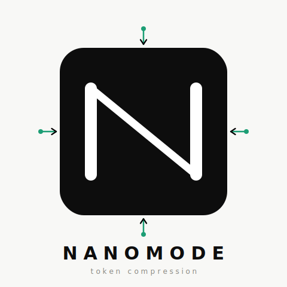

<div align="center">
  
  <h1>NanoMode</h1>
  <p><strong>-83% output tokens. Full technical accuracy. No style drift.</strong></p>
  <p>A Claude Code skill that compresses responses using 6 explicit rules — eliminating wasted tokens without losing information.</p>

  [](LICENSE)
</div>

---

## Install

```bash
git clone https://github.com/marcown10/nanomode.git /tmp/nanomode
cp -r /tmp/nanomode/nanomode ~/.claude/skills/
rm -rf /tmp/nanomode
```

Then in Claude Code, type `nanomode`. Claude responds: `[NanoMode V2] ON.`

---

## The problem it solves

Claude's default responses are full of words that add no information:

```
❌  "Sure! I'd be happy to help you with that. The reason your container
     is restarting is likely because the main process is exiting. I would
     recommend checking the logs with docker logs to see what's happening."

✓   cause: main process exits → restart loop
    docker logs <id> --tail 50
    0=cmd done | 1=err | 137=OOM | 143=SIGTERM
```

Same answer. 80% fewer words. NanoMode eliminates the padding while keeping everything technically accurate.

---

## When to use it

**Use V2 (default) for:**
- Long coding or infra sessions where you read dozens of responses
- Debugging — you want the fix, not an explanation of the fix
- K8s, Docker, HAProxy, SSH config — responses are dense by nature

**Switch to V3 (`/structured`) for:**
- Bugs you don't understand yet — `[DEBUG]` format is faster to scan
- Code review — `✗/~/✓` severity format is immediately actionable
- Explaining something that a teammate will read

**Turn it off (`normal mode`) for:**
- Writing documentation or prose
- Conversations where tone matters

---

## The 6 Compression Rules

| Rule | Before | After |
|---|---|---|
| Kill auxiliary verbs | `The cause is that X happens` | `cause: X` |
| Symbol compression | `leads to a re-render` | `→ re-render` |
| Remove connector prose | `To fix this, run: docker logs` | `docker logs <id>` |
| Abbreviate paths | `/etc/ssh/sshd_config.d/*.conf` | `sshd_config.d/*.conf` |
| Collapse parallel items | 3-line bullet list | `0=done \| 1=err \| 137=OOM` |
| No preamble / no sign-off | `Sure! Great question. I hope this helps!` | *(nothing)* |

### Always banned

```
Sure | Of course | Great question | I'd be happy to | Let me explain
I hope this helps | Let me know if you have questions
It might be worth | You could potentially | Depending on your setup
```

---

## Modes

| Command | Mode | Token reduction |
|---|---|---|
| `nanomode` or `/nano` | **V2 dense** (default) | **-83%** |
| `/structured` | V3 adaptive patterns | -71% |
| `/micro` | pure key:value, no prose | -85%+ |
| `/raw` | maximum symbol density | -88%+ |
| `normal mode` | off | — |

### V2 dense

```
cause: new obj ref each render → shallow compare fails → re-render
fix:
  inline obj → useMemo(() => ({...}), [deps])
  inline fn  → useCallback(() => fn(), [deps])
  child      → React.memo(Child)
debug: DevTools Profiler
```

### V3 structured — response patterns by question type

Claude classifies the question internally (zero extra tokens) and applies the right format:

**`[DEBUG]`** — something is broken:
```
[DEBUG] container exits → K8s backoff loop (10s→20s→40s→5min)

diag:
  kubectl logs <pod> --previous   → crash output, start here
  kubectl describe pod <pod>      → exit code + Events

exit→fix:
  1   → app bug → read --previous
  137 → OOM → increase limits.memory
  143 → liveness too aggressive → increase initialDelaySeconds
  0   → CMD is not long-running → fix entrypoint

stuck? kubectl run d --image= -it --restart=Never -- /bin/sh
```

**`[FIX]`** — specific error, known cause:
```
[FIX] don't check manually — jwt.verify() handles expiry

before: if (payload.exp < Date.now()) ...
after:
  try {
    req.user = jwt.verify(token, SECRET);
    next();
  } catch (err) {
    res.status(401).json({ error: err.name === 'TokenExpiredError' ? 'expired' : 'invalid' });
  }

why:    exp in seconds | Date.now() in ms | < instead of <= passes expired tokens
verify: expired token → 401 expired ✓
```

**`[COMPARE]`** — choosing between options:
```
[COMPARE] merge on shared branches, rebase only locally

merge:  merge commit | exact history | safe | hashes unchanged
rebase: linear history | rewrites hashes → breaks others who pulled

use merge:  git merge --no-ff feature
use rebase: git rebase origin/main | rebase -i before PR
⚠           never rebase already-pushed branch
```

**`[REVIEW]`** — code or config review:
```
verdict: works but 2 blocking issues

✗ DB_PASSWORD in plaintext → move to .env | add .env to .gitignore
✗ no restart policy → restart: unless-stopped
~ version: '3' deprecated → remove the line
~ no healthcheck → orchestrator can't detect unready app
✓ port mapping 80:3000 correct
```

---

## Benchmarks

Token counts across 8 real technical prompts. Numbers are approximate — real savings will be close but vary slightly depending on how Claude phrases a given response.

| Prompt | Normal | V2 | V3 |
|---|---|---|---|
| React re-render bug | 298 | **46** | 84 |
| JWT expiry fix | 334 | **48** | 91 |
| PostgreSQL pool setup | 316 | **52** | 68 |
| Git rebase vs merge | 337 | **58** | 83 |
| Docker crash loop | 314 | **58** | 88 |
| HAProxy 503 | 312 | **60** | 96 |
| SSH root login | 273 | **52** | 94 |
| K8s CrashLoopBackOff | 296 | **53** | 107 |
| **Average** | **310** | **53** | **89** |
| **vs Normal** | — | **-83%** | -71% |

V3 costs ~34 more tokens per response than V2, but every response has a predictable structure you can scan in 2 seconds rather than read in full.

---

## What NanoMode never compresses

| Element | Why |
|---|---|
| Code blocks | One wrong character breaks it |
| Error messages | Must be verbatim to be searchable |
| Technical terms | `polymorphism` stays `polymorphism` |
| Security warnings | Truncating defeats the purpose |
| Destructive ops | `rm -rf`, `DROP TABLE`, prod deploys always get full warnings |

---

## File structure

```
nanomode/
├── SKILL.md                      # Core skill — loaded on activation
└── references/
    ├── banned-patterns.md        # Full banned phrase list (loaded on demand)
    └── benchmarks.md             # Token savings by task type (loaded on demand)
```

---

## Why explicit rules beat "be concise"

Vague style prompts like "be concise" degrade over long conversations — Claude gradually reverts to verbose defaults. NanoMode uses a SKILL.md loaded fresh each session with enumerated, testable rules. No drift because the rules are re-read every time.

The rules also apply to content types that style hints miss: filesystem paths, exit code tables, diagnostic command sequences, option flag lists — not just prose.

---

## Science

A March 2026 paper ["Brevity Constraints Reverse Performance Hierarchies in Language Models"](https://arxiv.org/abs/2604.00025) found that constraining LLMs to brief responses improved accuracy by 26 percentage points on certain benchmarks. Shorter is not less correct — often it forces identifying the actual answer rather than surrounding it.

---

## License

MIT — compress freely.

## Credits

Built by Marco — Senior SysAdmin and DevOps engineer at Iliad. Designed for real infrastructure work: HAProxy, Kubernetes, SSH, Docker, and long coding sessions where every token counts.
